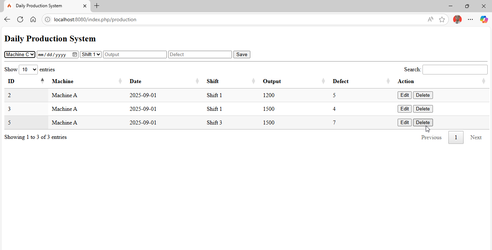

# Daily Production System 
## Simple Project using CodeIgniter 4 (CRUD, Datatable, Ajax, JOIN Query, SQL Server)
### Run
```bash
 php spark serve
 ```

#### Description
Daily Production System adalah aplikasi berbasis CodeIgniter 4 untuk manajemen produksi harian di manufaktur. Sistem ini menggunakan SQL Server sebagai database dan memiliki fitur CRUD, DataTables, AJAX, serta mendukung JOIN query antar tabel.

#### Fitur Utama

* CRUD

  - Create: `Menambahkan data produksi harian`.

  - Read: `Menampilkan data produksi di DataTable`.

  - Update: `Mengubah data produksi yang sudah ada`.

  - Delete: `Menghapus data produksi`.

* DataTables
    - Menampilkan data dengan pagination, sorting, dan search.
* Ajax
    - AJAX digunakan untuk memuat data secara dinamis dari server.

#### AJAX

Form input, update, dan delete menggunakan AJAX untuk pengalaman pengguna lebih cepat.

#### JOIN Query

Tabel Productions berelasi dengan Machines dan WorkOrders.

Contoh JOIN query di `ProductionModel.php`:
```angular2html
public function getProductionWithMaintenance()
{
    return $this->select('Productions.*, Machines.MachineName, Machines.Location, 
                          WorkOrders.WorkOrderID, WorkOrders.WODate, WorkOrders.Description, WorkOrders.Status')
                ->join('Machines', 'Machines.MachineID = Productions.MachineID')
                ->join('WorkOrders', 'WorkOrders.MachineID = Machines.MachineID', 'left')
                ->findAll();
}

```

### Database : SQL Server
Operational_management.dbo.table
* Machines
```
create table dbo.Machines
(
    MachineID   int identity
        primary key,
    MachineName nvarchar(100) collate SQL_Latin1_General_CP1_CI_AS not null,
    Location    nvarchar(100) collate SQL_Latin1_General_CP1_CI_AS
)
go
```
* Productions
```angular2html
create table dbo.Productions
(
    ProductionID   int identity
        primary key,
    MachineID      int  not null
        references dbo.Machines,
    ProductionDate date not null,
    Shift          nvarchar(20) collate SQL_Latin1_General_CP1_CI_AS,
    OutputQty      int,
    DefectQty      int
)
go
```
* WorkOrders
```angular2html
create table dbo.WorkOrders
(
    WorkOrderID int identity
        primary key,
    MachineID   int  not null
        references dbo.Machines,
    WODate      date not null,
    Description nvarchar(200) collate SQL_Latin1_General_CP1_CI_AS,
    Status      nvarchar(50) collate SQL_Latin1_General_CP1_CI_AS
)
go
```

### Structure Project
```angular2html
app/
├── Controllers/
│   ├── Home.php
│   ├── Production.php
│   ├── Machine.php
│   └── Maintenance.php
├── Models/
│   ├── ProductionModel.php
│   └── MachineModel.php
├── Views/
│   ├── home/index.php
│   ├── production/index.php
│   ├── machine/index.php
│   └── maintenance/index.php

```

### Screenshoot

<br>
